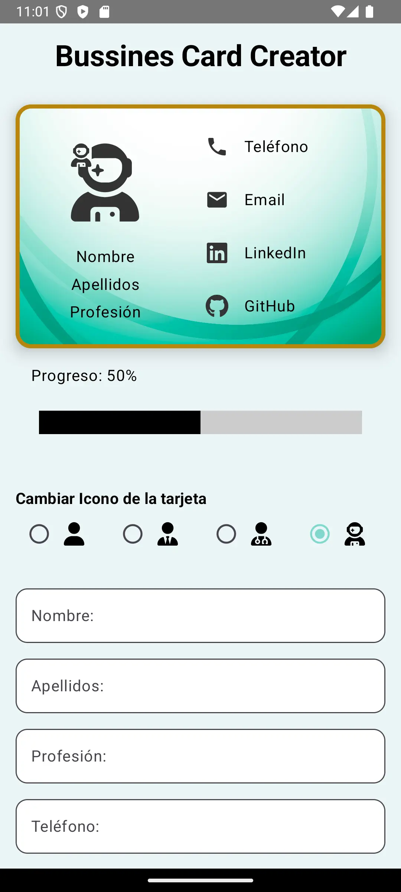
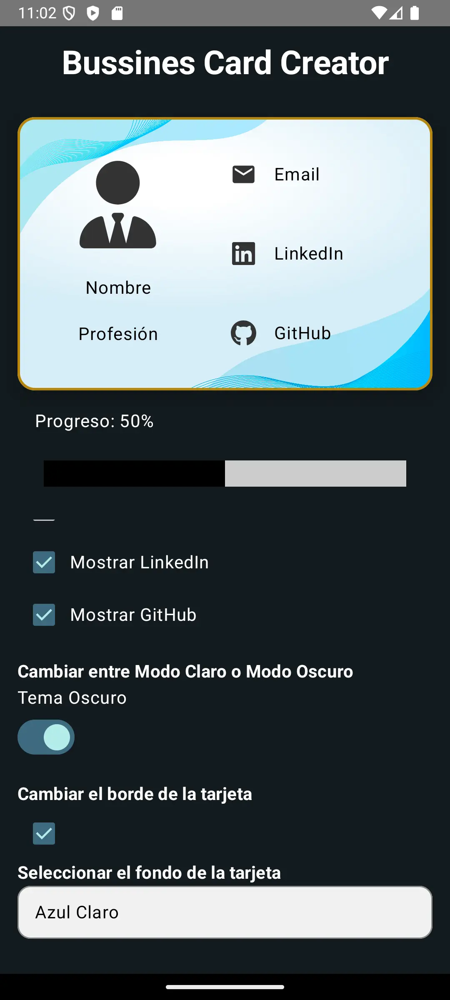

<div align="center">

# 💸💳 Bussiness Cards 💳💸

<br>

## 📅 Enunciado de la práctica 📅

</div>
</br>

```kotlin
class BusinessCardsApp {

    private val components = listOf(
        "Text: Per mostrar missatges a l’usuari.",
        "TextField: Per tal de que l’usuari introdueixi les seves dades.",
        "CheckBox: Per seleccionar incloure o no alguna informació (ex. cognoms, càrrec, etc.).",
        "Switch: Per escollir colors i aspectes gràfics de la targeta.",
        "TriState: Per escollir entre tres opcions que decidiu vosaltres.",
        "RadioButton: Per escollir aspectes gràfics de la targeta.",
        "Icon: Per a què l’usuari pugui afegir icones a la seva targeta (estrelles, casetes, etc.).",
        "Image: Per tal de que l’usuari pugui afegir una imatge de fons a la targeta.",
        "Card: Per confeccionar la targeta a sota de les opcions anteriors.",
        "Progress Indicator: Per mostrar l’avenç en la creació de la targeta fins a acabar-la."
    )

    fun showAppDescription() {
        println("🎉 Benvinguts a Business Cards App! 🎉")
        println("👨‍💻 EXERCICIS ANDROID STUDIO II")
        println("Introducció a la interfície gràfica i interacció amb els seus elements.\n")
        println("✨ Aquesta aplicació permet crear targetes de visita (business cards).")
        println("📋 Components disponibles dins d’una mateixa activitat:")
        components.forEach { println("   - $it") }
        println("\n📦 Let's get creative!")
    }
}

fun main() {
    val app = BusinessCardsApp()
    app.showAppDescription()
}
```

</br>

---

</br>

<div align="center">

### 📝 **Descripción funcional de la App** 📝

</br>
<p>
Esta aplicación es un creador de tarjetas de visita completamente personalizable,. Diseñada con una interfaz intuitiva, permite a los usuarios introducir, organizar y estilizar la información que desean mostrar en sus tarjetas de presentación.</br>
</p>
</br>

 ### ✔️ **La App cumple con los siguientes requisitos** ✔️

</br>
<p>
 
• ***[Texto]*** Para mostrar mensajes y etiquetas que guían al usuario.</br>
</br>
• ***[TextField]*** Campos donde el usuario puede introducir su información personal, como nombre, apellidos, cargo y detalles de contacto.</br>
</br>
• ***[CheckBox]*** Permite seleccionar qué información incluir, como apellidos, cargo o redes sociales.</br>
</br>
• ***[Switch]*** Alterna entre los temas de la tarjeta, por ejemplo, modo claro y oscuro.</br>
</br>
• ***[TriState]*** Opción de selección múltiple para modificar aspectos del borde de la tarjeta.</br>
</br>
• ***[RadioButton]*** Selección de iconos que representan el perfil, como iconos prediseñados para diferentes profesiones.</br>
</br>
• ***[Icono]*** Permite agregar un icono de perfil en la tarjeta.</br>
</br>
• ***[Imagen]*** Selección de imagen de fondo de entre opciones predefinidas, sin interferir en la legibilidad.</br>
</br>
• ***[Card]*** Estructura visual de la tarjeta, que se genera en tiempo real en la interfaz.</br>
</br>
• ***[Progress Indicator]*** Indicador de progreso que muestra el avance en la personalización de la tarjeta.</br>

</br>
</p>
</br>

---

</br>

### 📸 **Capturas** 📸

</br>
<table align="center">
  <tr>
    <td align="center">
      
      <p>Captura 1</p>
    </td>
    <td width="100"></td> <!-- Celda vacía para espacio -->
    <td align="center">
      
      <p>Captura 2</p>
    </td>
  </tr>
</table>
</br>

---

### 🛠️ Tecnologías y Herramientas 🛠️

</br>

 
  
<br><br><br>


***

<p>
  Integrantes:
  Alberto Rodellar,
  Leandro Struni</br>
</p>


<table align="center">
  <tr>
    <td>
      <table align="center">
        <tr>
          <td align="center">
            <a href="https://github.com/LeanEmanuel">
              
            </a>
          </td>
        </tr>
        <tr>
          <td>
            <a href="https://github.com/LeanEmanuel">
              
            </a>
          </td>
        </tr>
      </table>
    </td>
    <td>
      <table align="center">
        <tr>
          <td align="center">
            <a href="https://github.com/AlbertoRodellar">
              
            </a>
          </td>
        </tr>
        <tr>
          <td>
            <a href="https://github.com/AlbertoRodellar">
              
            </a>
          </td>
        </tr>
      </table>
    </td>
  </tr>
</table>
 

<!-- Logo GitHub -->

</div>
